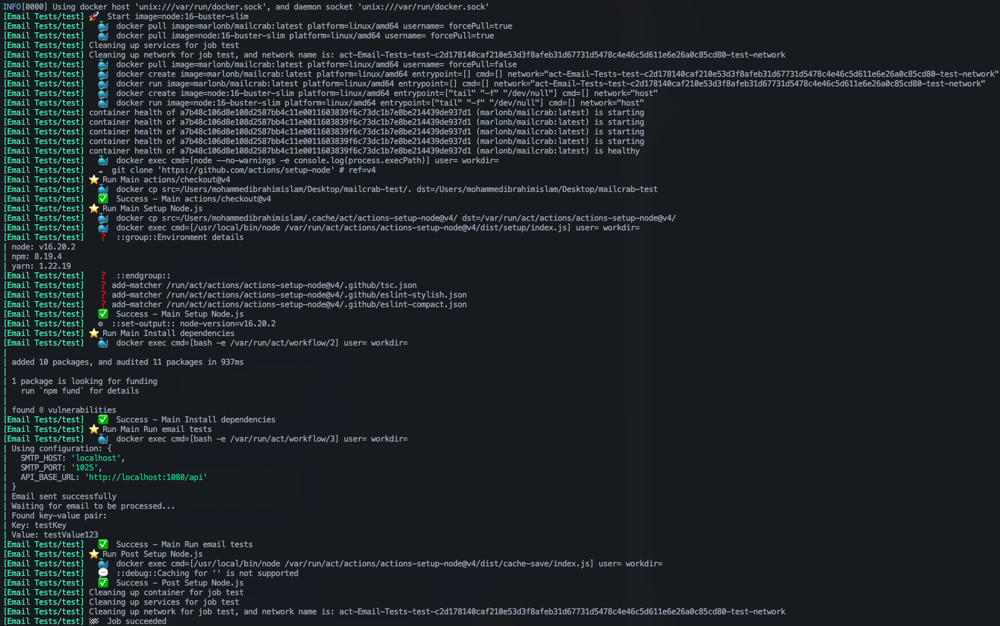

{width=600 height=400}

# Email Testing Automation POC

This repository demonstrates a proof of concept for implementing an email testing solution in automation workflows using MailCrab, a lightweight SMTP testing server.

## Overview

The POC shows how to:
- Send emails programmatically in tests
- Capture and verify emails using MailCrab's API
- Run tests both locally and in CI/CD pipelines (GitHub Actions)

## Why This Approach?

### Benefits of Email Testing with MailCrab
- No need for real email accounts or external services
- Fast and reliable - emails are processed instantly
- Full control over the test environment
- Zero configuration required - works out of the box
- Lightweight (7.77 MB Docker image)
- REST API for easy integration with test frameworks
- Web interface for manual inspection when needed

### Key Technical Advantages
- In-memory storage - fast and ephemeral
- Built-in SMTP server that accepts all emails
- Multi-arch support (amd64, arm64)
- Simple API for retrieving and verifying emails
- Easy integration with CI/CD pipelines
- Docker-ready with health checks

## Running Tests

### Locally with Docker Compose
```bash
docker compose up
```

### Locally with Act
```bash
#add `--container-architecture linux/amd64` if running on Apple Silicon
act
```
